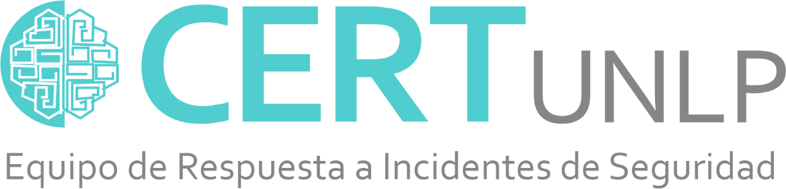

  

	

  

---

<h1 align="center"> Manual de usuario </h1>
<h1 align="center"> Extra - Analizadores</h1>

---

  

## Índice

- [Introducción a los Analizadores](#introducción-a-los-analizadores)
  - [¿Qué son los Analizadores?](#qué-son-los-analizadores)
  - [Propósito de los Analizadores](#propósito-de-los-analizadores)
  - [Integración con Fuentes Externas](#integración-con-fuentes-externas)
- [Analizadores](#analizadores)
  - [Kintun: Escaner de vulnerabilidades](#kintun-escaner-de-vulnerabilidades)
    - [Función de Kintun](#función-de-kintun)
    - [Integración con NGEN](#integración-con-ngen)
    - [Uso de Kintun en NGEN](#uso-de-kintun-en-ngen)

---

# Introducción a los Analizadores

Los analizadores en NGEN son componentes esenciales que permiten a la plataforma integrar y procesar información proveniente de fuentes externas de ciberseguridad. Estos elementos enriquecen los datos asociados a los eventos y casos gestionados en NGEN, proporcionando información adicional que facilita la evaluación, investigación y respuesta a incidentes de seguridad. Este documento explica qué son los analizadores, su propósito y cómo funcionan.

## ¿Qué son los Analizadores?

Los analizadores son herramientas o servicios que conectan NGEN con sistemas externos, como escáners de vulnerabilidades o bases de datos de amenazas. Actúan como intermediarios permitiendo a la plataforma obtener datos relevantes de estas fuentes y asociarlos a los eventos y casos internos.

Cada analizador está vinculado a taxonomías específicas, lo que significa que NGEN puede solicitar información externa basada en la clasificación de un evento.
Los analizadores en NGEN, como Kintun, son herramientas poderosas que enriquecen la gestión de incidentes de ciberseguridad al integrar información externa valiosa. Al conectar NGEN con fuentes especializadas, los analizadores permiten obtener una visión más completa de los eventos y casos, automatizar tareas críticas y mantener la información actualizada.

## Propósito de los Analizadores

El objetivo principal de los analizadores es complementar la información de los eventos en NGEN con datos externos, mejorando la capacidad de toma de decisiones de los equipos de respuesta a incidentes. Estos analizadores permiten a los miembros del CSIRT verificar manualmente si un artefacto asociado a un evento (como una IP o dominio) sigue activo o está relacionado con comportamientos maliciosos conocidos. Esto evita la necesidad de realizar pruebas manuales externas, facilitando la tarea de retests y enriqueciendo los eventos con información relevante y actualizada.

## Integración con Fuentes Externas

La integración de los analizadores en NGEN se realiza a través de la sección **Mapeo de Analizadores** en la plataforma. Aquí, los usuarios pueden definir relaciones entre las taxonomías internas de NGEN y las taxonomías utilizadas por los analizadores externos. Esta vinculación permite que NGEN solicite datos relevantes cuando un evento coincide con una taxonomía mapeada.

Por ejemplo, si un evento tiene la taxonomía "Vulnerable" y existe un mapeo con un analizador de vulnerabilidades, NGEN puede activar dicho analizador para obtener más información sobre la red o sistema afectado.

# Analizadores

## Kintun: Escaner de vulnerabilidades

**Kintun** es un analizador específico integrado en NGEN, diseñado para escanear redes en busca de vulnerabilidades o malas configuraciones. Se trata de un escáner de vulnerabilidades RESTful, lo que permite a NGEN interactuar con él mediante una API para solicitar escaneos y recibir resultados de forma automática. Más detalles sobre Kintun están disponibles en su repositorio: [https://github.com/CERTUNLP/kintun](https://github.com/CERTUNLP/kintun/blob/master/README.md).

### Función de Kintun

Kintun realiza escaneos de vulnerabilidades en redes utilizando herramientas como Nmap para identificar puertos abiertos, servicios vulnerables y otras debilidades de seguridad. Los resultados de estos escaneos se exportan a NGEN, donde se utilizan para complementar la información de los eventos. Por ejemplo, si un evento reporta una posible vulnerabilidad en un servidor, Kintun puede escanearlo para confirmar la presencia de dicha vulnerabilidad y proporcionar detalles técnicos adicionales.

### Integración con NGEN

Kintun se integra en NGEN mediante el mapeo de analizadores. Los usuarios pueden vincular taxonomías internas (como "Vulnerable") con las taxonomías definidas en Kintun. Una vez configurado este mapeo, NGEN puede:

- **Solicitar escaneos automáticos**: Cuando un evento coincide con una taxonomía mapeada, NGEN puede enviar una solicitud a Kintun para escanear la red o dominio asociado.
- **Mostrar resultados en el detalle de un evento**: Los resultados de los escaneos aparecen en la sección de **retests** dentro del detalle de un evento, permitiendo a los analistas revisar la información obtenida.

### Uso de Kintun en NGEN

El uso de Kintun dentro de NGEN incluye las siguientes funcionalidades:

- **Retests manuales**: En el detalle de un evento, los usuarios pueden iniciar manualmente un nuevo retest para obtener información actualizada. Esto es útil para verificar si una vulnerabilidad ha sido mitigada o si persiste.
- **Visualización de resultados**: Los resultados de los escaneos se presentan en una tabla dentro de la sección de retests, con opciones para refrescar los datos o iniciar nuevos escaneos.

Por ejemplo, si un evento indica una posible vulnerabilidad en un servidor web, un retest con Kintun puede confirmar si el servidor sigue siendo vulnerable o si las medidas de mitigación han sido efectivas.

---

  

	

  
