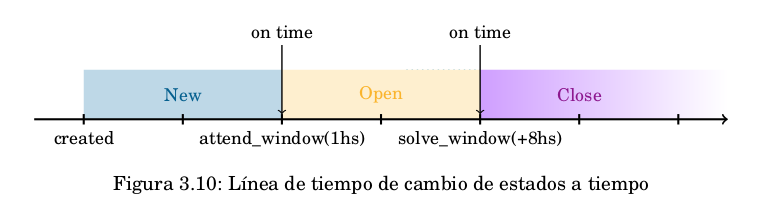

  

	

  

---

<h1 align="center"> Manual de Usuario </h1>
<h1 align="center">NGEN </h1>

---

  

## Índice

[**Configuración Inicial**](#configuración-inicial)

- [Configuraciones globales](#configuraciones-globales)

[**Estructura**](#estructura)

- [**1\. Principal**](#1-principal)

	- [1.1. Métricas](#11-métricas)

	- [1.2. Eventos](#12-eventos)

		- [1.2.1. Listado de eventos](#121-listado-de-eventos)

		- [1.2.2. Detalle de los eventos](#122-detalle-de-los-eventos)

	- [1.3. Casos](#13-casos)

		- [1.3.1. Listado de casos](#131-listado-de-casos)

		- [1.3.2. Detalle de los casos](#132-detalle-de-los-casos)

		- [1.3.3. Ventanas de tiempo](#133-ventanas-de-tiempo)

			- [1.3.3.1. Ventanas de atención y resolución](#1331-ventanas-de-atención-y-resolución)

- [**2\. Constituencias**](#2-constituencias)

	- [2.1. Entidades](#21-entidades)

	- [2.2. Redes](#22-redes)

	- [2.3. Contactos](#23-contactos)

- [**3\. Configuración**](#3-configuración)

	- [3.1. Plataforma](#31-plataforma)

		- [3.1.1. TLP](#311-tlp)

		- [3.1.2. Reporte](#312-reporte)

		- [3.1.3. Fuentes](#313-fuentes)

		- [3.1.4. Prioridades](#314-prioridades)

		- [3.1.5. Playbooks](#315-playbooks)

		- [3.1.6. Taxonomía](#316-taxonomía)

		- [3.1.7. Grupos de Taxonomías](#317-grupos-de-taxonomías)

		- [3.1.8. Estados](#318-estados)

			- [3.1.8.1. Transiciones](#3181-transiciones)

		- [3.1.9. Plantilla](#319-plantilla)

		- [3.1.10. Usuarios](#3110-usuarios)

		- [3.1.11. Configuración](#3111-configuración)

- [**4\. Perfil**](#4-perfil)

# **Configuración Inicial**

Al instalar e iniciar el sistema NGEN se encontrará con las credenciales por defecto ngen:ngen, debería modificarlas o bien crear nuevas credenciales y eliminarlas.  
Asimismo, el sistema incluye tres redes preestablecidas que son las bases, una IPv4, IPv6 y un dominio por defecto. Estas no deben ser modificadas ni eliminadas, y deben crearse las redes necesarias para su organización.   
Respecto a las entidades incluye una por defecto, que debe ser modificada para que represente a la organización/constituency. Por otra parte, incluye un contacto que también debe ser modificado. 

## Configuraciones globales

En el repositorio [https://github.com/CERTUNLP/ngen](https://github.com/CERTUNLP/ngen) se encuentran dos versiones de NGEN, una para desarrollo (docker/ngen.env) y otra para producción (docker/ngen.prod.env).  
La versión de producción es una extensión de la versión de desarrollo, cuando se utiliza se sobreescribe el ngen.env correspondiente a desarrollo.   
Para usar y probar las versiones solo hace falta realizar cambios cuando se utilice en un servidor. En ese caso se debe cambiar la variable llamada VITE\_APP\_API\_SERVER, que se encuentra en la primera línea de código, y debe apuntar a la versión pública del backend (ej: [HTTPS://NGEN-YOUR-SITE/API](HTTPS://NGEN-YOUR-SITE/API))

# **Estructura** 

El sistema NGEN posee un menú principal que se encuentra dividido en tres secciones: Principal, Constituencias, y Configuración. A continuación se detalla cada una de ellas.

## 1. **Principal** 

En esta sección se encuentra la información de mayor relevancia tanto para el equipo que gestiona los incidentes de ciberseguridad como para los tomadores de decisiones. 

### 1.1. Métricas

En las métricas se incluyen gráficos que muestran indicadores sobre las fuentes de información y las entidades afectadas. Asimismo contiene un panel que resume los últimos eventos y casos del período seleccionado.   
La información de esta pantalla corresponde, por defecto, a la última semana. Sin embargo, el rango de fechas puede ser seleccionado por el usuario.

### 1.2. Eventos 

Un evento representa un potencial incidente de ciberseguridad que deberá ser evaluado para determinar si se trata de un verdadero positivo o no. El mismo tiene asociadas evidencias y artefactos[^1]. 

Cada evento tiene asociado un identificador, que corresponde al CIDR o dominio afectado (siendo mutuamente excluyentes entre sí). Ambos son considerados por el sistema como artefactos.

Los eventos cuentan con la particularidad de poder fusionarse (acción que se conoce como “Merge”). Cuando dicha fusión ocurre, un evento pasa a ser el padre del resto y es el que reúne la información más importante de todos los que se fusionaron (como las evidencias y artefactos). A partir de ese momento los eventos hijos dejan de estar visibles al usuario final como eventos individuales en el listado. 

#### 1.2.1. Listado de eventos 

En esta sección del sistema podemos encontrar el listado de los eventos, cada uno de ellos está representado por:

* la fecha de la última modificación;   
* la fecha de creación;  
* un identificador único en el sistema (uuid);  
* el identificador relativo al dominio o cidr afectado;  
* la clasificación según tlp;  
* la cantidad de eventos hijos que tiene como consecuencia de una fusión (“merge”);  
* la taxonomía;   
* la fuente de información que envió el reporte;   
* si el evento está o no asignado a un caso, en caso de estar asignado se muestra un botón que permite visualizar el caso;

Asimismo, cada evento en el listado incluye opciones que permiten verlo, editarlo o borrarlo y la posibilidad de crear [plantillas](#plantilla) a partir de los atributos que posee.

#### 1.2.2. Detalle de los eventos 

En el detalle de un evento, además de los datos presentes en el listado de eventos, se puede encontrar:

* la prioridad, que es la establecida al momento de creación del evento;  
* el padre, en caso de ser un evento hijo como resultado de una fusión;  
* un booleano que indica si el evento se fusionó con otros;  
* la taxonomía inicial, la cual indica el slug con el que llegó al sistema;  
* el reportero, es decir, el usuario que reportó el evento;  
* la cantidad de hijos, si resulta ser un evento padre luego de una fusión;  
* un booleano que indica si el evento se encuentra bloqueado;  
* detalles del caso relacionado, si lo tuviera;  
* los artefactos;  
* las evidencias;  
* las notas. 

### 1.3. Casos  

Un caso es una investigación sobre un potencial incidente de seguridad que tiene asociado uno o más eventos, y cuenta con evidencias propias.   
Asimismo, los casos pueden fusionarse (acción que se conoce como “Merge”). 

#### 1.3.1. Listado de casos

En esta sección del sistema se encuentra el listado de casos, cada caso está representado por:

* la fecha de inicio de gestión;  
* la fecha de la última modificación;   
* un identificador único en el sistema (uuid);  
* un nombre, que es opcional;  
* la prioridad;  
* la clasificación según tlp;  
* el estado;  
* el/los dominios o CIDRs afectado/s;  
* el usuario que lo tiene asignado, si lo tuviera.

#### 1.3.2. Detalle de los casos

Al ingresar al detalle de un caso, además de los datos presentes en el listado de casos, se pueden encontrar:

* el ID de ese caso en el sistema;  
* el ciclo del vida del caso;  
* la fecha de atención, que contiene el timestamp del momento en el que el caso fue atendido;  
* la fecha de resolución, que contiene el timestamp del momento en el que el caso fue resuelto;  
* la fecha de creación, que contiene el timestamp del momento de creación del caso;  
* las evidencias;  
* los eventos involucrados en el caso;  
* los comentarios. 

#### 1.3.3. Ventanas de tiempo 

La fecha de atención y la fecha de resolución son valores autoasignados al caso, se determinan cuando cambian a estados que tienen las características "attended" y "solved" definidas. Por ejemplo, un estado new tiene attended=false solved=false, si se pasa el caso a un estado open que tiene attended=true solved=false se le cambia al caso la fecha de atención a la hora en la que se realizó el cambio de estado a open. Cuando pasa de open a closed, como closed tiene attended=true solved=true se cambia el valor de la fecha de resolución del caso a la fecha y hora en la que se realizó el cambio de estado.

Por su parte, la fecha de inicio de gestión es asignada manualmente por un operador, si no es asignada su valor por defecto es la fecha de creación del caso. 

#### 1.3.3.1. Ventanas de atención y resolución

La ventana de atención, attend window, está dada por la fecha de creación del caso (case:created) sumada al tiempo de atención establecido para la prioridad que tiene el caso (priority:attend\_time).   
La ventana de resolución, solve window, está dada por la fecha de atención del caso (case:attend\_date) sumada al tiempo de resolución asignado a la prioridad que tiene el caso (priority:solve\_time.).  

	
	 
	
	 
	

El sistema permite calcular el tiempo que transcurre desde que se debería haber empezado a atender el caso y realmente se empieza a atender. Esta ventana de tiempo sin atender, unattend window, se calcula de la siguiente forma: a la suma de la fecha en que se creó el caso con la fecha de atención se le resta la ventana de atención (unattend window: (case:created \+ attend\_date) \- attend window). 

El sistema permite calcular el tiempo que transcurre desde que se debería haber resuelto el caso y realmente se resuelve. Esta ventana de tiempo sin resolver, unsolve window, se calcula de la siguiente forma: a la suma de la fecha en que se atendió el caso con la fecha de resolución se le resta la ventana de resolución (unsolve window: (case:attend\_date \+ solve\_date) \- solve window).    

	

## 2. **Constituencias**  

La sección “Constituencias” representa la comunidad objetivo del equipo de respuesta a incidentes. 

### 2.1. Entidades 

Lista las instituciones de la comunidad objetivo a las que se le deberá notificar sobre los incidentes. 

### 2.2. Redes  

Esta sección lista las redes que forman parte de la comunidad objetivo.  
Una red representa un rango de direcciones IPs o un dominio que le pertenece a una entidad de la comunidad objetivo. Tanto las IPs como los dominios se representan en estructura de árbol dónde las raíces son: 

* CIDR:  
  * IPV4 \= 0.0.0.0/0
  * IPV6 \= 0::0/0
    

		
      		 <em>Árbol IPv4</em>
    

* Dominio: 
	

 		
      		 <em>Árbol de dominios</em>
	

### 2.3. Contactos

Este apartado lista los contactos de la comunidad objetivo. Un contacto representa un medio de comunicación asociado a una red.   
Asimismo, se definen prioridades para los contactos. Cuando se debe reportar un incidente a un contacto el mismo solo reportará si la prioridad del evento perteneciente al incidente es mayor o igual a la prioridad del contacto.

## 3. **Configuración** 

### 3.1. Plataforma   

En esta sección se encuentra la configuración que no suele variar en el tiempo y que no necesita una revisión o modificación constante. 

#### 3.1.1. TLP 

En este apartado se encuentra una descripción del protocolo TLP utilizado tanto para los eventos como para los casos.   
Este protocolo es el utilizado al momento de compartir la información con un tercero para indicarle qué tiene permitido hacer con esa información.

#### 3.1.2. Reporte 

En esta sección se encuentra el listado de los reportes existentes indicando a qué taxonomía pertenecen y el idioma en el que se encuentran.   

Si la taxonomía a la cual pertenece el incidente no cuenta con reporte propio entonces el sistema escalará a través de la estructura de árbol y utilizará el primer reporte que encuentre en alguno de los padres.   

Supongamos la siguiente taxonomía:
	

			
	

	  
Si se requiere reportar un incidente del tipo DoS Chargen pero este no cuenta con un reporte propio el sistema buscará automáticamente a su padre dentro de la estructura de árbol (DoS) y se comprobará si tiene un reporte relacionado, en caso de que lo tuviera enviará ese reporte al contacto indicando la taxonomía original del incidente (DoS Chargen). En el caso de que DoS no tuviera reporte asignado seguirá buscando en el árbol hasta encontrar un padre que lo tenga, en el ejemplo buscaría en Availability.   

#### 3.1.3. Fuentes

Lista las fuentes de información que se integran con el sistema NGEN de las cuales se recopilan eventos de ciberseguridad. 

#### 3.1.4. Prioridades

Permiten definir los niveles de urgencia con los que se deberán atender los eventos o los casos. Aquí se determina el tiempo en el que se deberán atender y resolver.

#### 3.1.5. Playbooks 

Un playbook representa un protocolo a seguir al momento de recibir un evento de un determinado tipo (en función de la taxonomía). Cada playbook contiene un conjunto de tareas que representan las instrucciones a seguir. 

#### 3.1.6. Taxonomía 

Representa el esquema de clasificación de eventos de ciberseguridad utilizado.   

Al crear una nueva taxonomía se puede definir si tiene un padre o un grupo, se debe tener en cuenta que son mutuamente excluyentes.  
Una clase interna puede tener un padre, por lo que el sistema permite armar un esquema de tipos y subtipos.   

El grupo indica a qué grupo de taxonomías externas pertenece, si no se selecciona ninguna opción el sistema interpretará que esa clase es parte de la taxonomía interna de la organización. Asimismo, si se selecciona un grupo se debe indicar de qué taxonomía es alias dentro del esquema interno. 

#### 3.1.7. Grupos de Taxonomías 

Representa los esquemas de clasificación de eventos de ciberseguridad utilizados por la organización y por los feed a partir de los cuales se obtiene la información relativa a los incidentes y vulnerabilidades.   
Los esquemas de clasificación ajenos a la organización se vinculan con el esquema interno a través de los alias. Cada tipo de incidente o vulnerabilidad que es parte de un esquema externo será un alias de un tipo propio de la organización. Por ejemplo: blacklisted-ip de shadowserver puede ser un alias del tipo blocklist de la organización.

#### 3.1.8. Estados 

Define los estados de avance del tratamiento de un caso. Por ejemplo, “Nuevo”, “Abierto”, “Cerrado”. Cada estado tiene dos variables relacionadas, atendido y resuelto. 

- Initial: el valor de ambas variables es falso.   
- Staging: el valor de ambas variables es falso.   
- Open: el valor de atendido es verdadero y el de resuelto es falso.  
- Closed: ambas variables tienen el valor verdadero. 

##### 3.1.8.1. Transiciones 

El sistema incluye por defecto las siguientes transiciones:

- initial \-\> staging;  
- initial \-\> open;   
- staging \-\> open;  
- staging \-\> closed;  
- open \-\> closed;  
- closed \-\> staging.

#### 3.1.9. Plantilla 

Una plantilla define la creación automática de un caso ante la presencia de eventos con determinadas características.   
Por ejemplo, se puede definir una plantilla que a partir de un evento de tipo Vulnerable en la red 10.10.0.0/16 que llegue del feed Shadowserver se cree automáticamente un caso con una prioridad y un TLP determinado. 

#### 3.1.10. Usuarios 

En esta sección se pueden crear, modificar y borrar los usuarios de la plataforma NGEN. 
	

		
	

Los usuarios pueden estar activos o no en el sistema, también se pueden definir los permisos, que serán descritos a continuación: 

- Si es un superusuario tiene todos los permisos, no es recomendable su uso para todos los usuarios.  
- Ser parte del staff solo habilita a realizar determinadas acciones, es adecuado tenerlo activado solo para los miembros del equipo.  
- El ser administrador de red es un valor calculado en función de si existe un contacto que tenga relacionado a ese usuario. Esto puede cambiarse a través del formulario de contacto. Sin embargo, no se le da al usuario los permisos de administrador de red automáticamente, si no que los permisos deben ser concedidos/agregados explícitamente.

Asimismo, se pueden definir roles dentro del sistema, NGEN incluye por defecto los siguientes:

- Administrador (Administrator), un usuario con este rol tiene habilitados todos los permisos y acceso a todas las funcionalidades.  
- Analista (Analyst), tiene permisos para gestionar los incidentes y además puede modificar la configuración relativa a la gestión, por ejemplo la taxonomía, los estados, entre otros.   
- Gestor de incidentes (Incident Responder), un usuario con este rol solo tiene permisos para gestionar incidentes, esto incluye cambiar el estado de los eventos y los casos, también editarlos.    
- Administrador de red (Network Admin), al ingresar al sistema un usuario con este rol tiene otras vistas: evento, caso, entidades, redes y contactos. Estas vistas solo mostrarán su información propia, es decir, aquella que esté relacionada con los contactos que estén vinculados con su usuario.  
- Generador de eventos (Event Publisher), un usuario con este rol es aquel que puede publicar eventos, es el único permiso que posee. Su uso es adecuado para los bots.

#### 3.1.11. Configuración  

Permite definir parámetros globales del sistema, por ejemplo el idioma, la dirección de email que utilizará el sistema para los reportes, etc. 

## 4. Perfil 

Permite visualizar la información del usuario logueado, así como cambiar su contraseña  y acceder a la API key. Se debe tener en cuenta que quien posea la API key de un usuario tendrá acceso a los mismos permisos que él.  

[^1]:  Artefactos: son todos los observables asociados a un potencial incidente de ciberseguridad como por ejemplo hashes, IPs, dominios, etc.

---

 

	

  
